# Fluxos das duas pontas

> **Entregável 1.3 da Fase 1.**
>
> Este documento não depende da conversa com a Rosiele: ele deriva de decisões já
> tomadas — [DEC-007](04-DECISOES.md#dec-007) (dois públicos, um código),
> [DEC-008](04-DECISOES.md#dec-008) (dois domínios de identidade) e
> [DEC-009](04-DECISOES.md#dec-009) (CPF com hash e criptografia).
>
> Escrevê-lo agora teve um propósito além de documentar: **percorrer os fluxos com
> rigor expõe os buracos.** Encontrei três, e eles estão na seção 6. Um deles
> quebra o ponto de encontro entre as duas pontas do produto.

---

## 1. Panorama

O RoHair é um único código servindo dois aplicativos. O que os liga é o **CPF**.

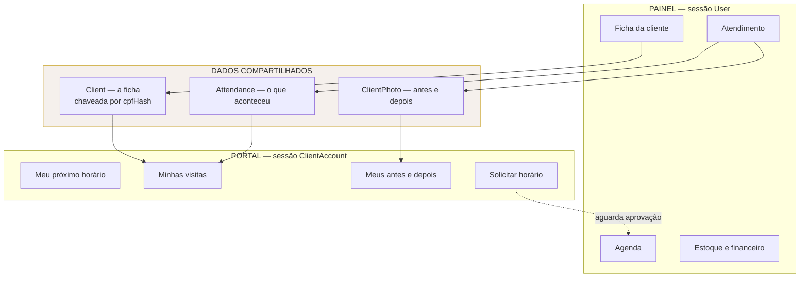

O portal **nunca** escreve direto na agenda. A única escrita da cliente que
atravessa para o painel é uma solicitação, que espera aprovação — pendente da
decisão [D-05](04-DECISOES.md#d-05--poder-de-agendamento-da-cliente-no-portal).

---

## 2. Identidade da equipe

### F-01 · Bootstrap da primeira conta

Executado **uma única vez**, por script, fora da aplicação. Não existe autocadastro
de equipe: se existisse, seria uma porta aberta para criar contas com privilégio.

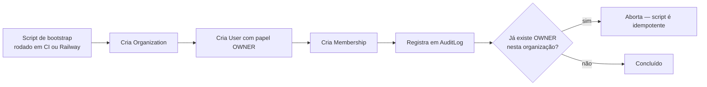

O script **precisa ser idempotente**. Rodar duas vezes por engano não pode criar
uma segunda OWNER.

### F-02 · Login da equipe

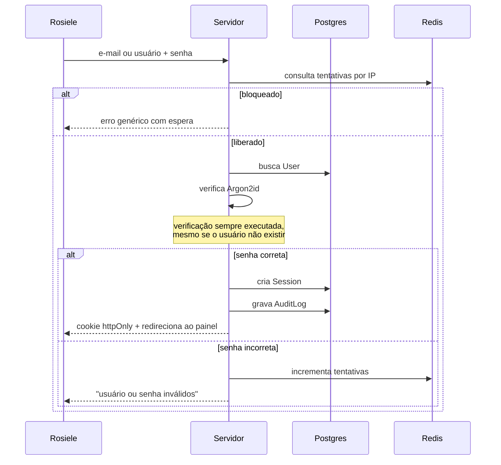

A verificação de Argon2id roda **mesmo quando o usuário não existe**, contra um
hash descartável. Sem isso, o tempo de resposta revela quais e-mails são válidos.

### F-03 · Criação de contas da equipe

A OWNER cria as demais pelo painel. Papéis: `OWNER` · `PROFESSIONAL` · `ASSISTANT`.

⚠️ Só vira tela real se a resposta à pergunta 4 do roteiro indicar que alguém
ajuda a Rosiele. Caso contrário, o modelo de dados existe desde a Fase 3 — porque
tirá-lo depois é migração de identidade — mas a interface fica para a Fase 16.

---

## 3. Identidade da cliente

### F-04 · Primeiro acesso — as três saídas

O fluxo central do produto, e o mais delicado.

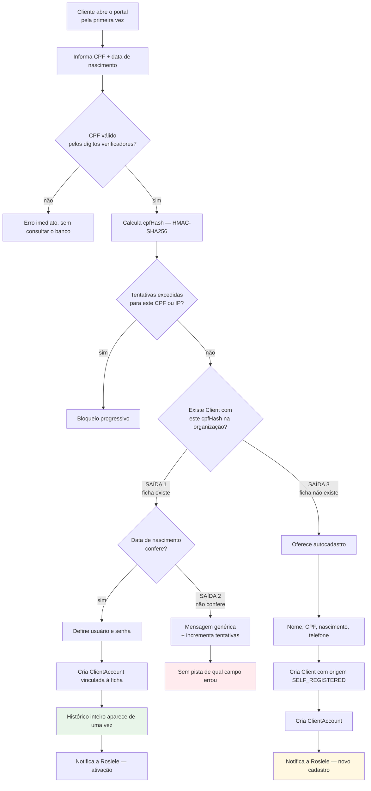

**A saída 1 é o coração do produto.** Uma cliente que a Rosiele atende há dois anos
abre o app pela primeira vez e vê dois anos de antes e depois. Não é
funcionalidade — é o momento em que o produto se justifica.

**A saída 3 é o ponto de encontro invertido.** A cliente chega antes do cadastro, e
quando a Rosiele for lançar o atendimento a ficha já está lá, preenchida por ela
mesma.

### F-05 · Acessos seguintes

Usuário + senha. Sem CPF, sem data de nascimento — a porta de CPF só se abre para
ativação e recuperação.

### F-06 · Recuperação de senha

A mesma porta do primeiro acesso: CPF + data de nascimento confere, define nova
senha. Sem e-mail, sem SMS, custo zero.

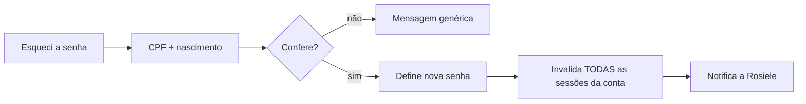

Invalidar as sessões existentes é obrigatório: sem isso, quem tomou a conta
continua dentro depois que a dona legítima troca a senha.

### F-07 · Roteamento pós-login

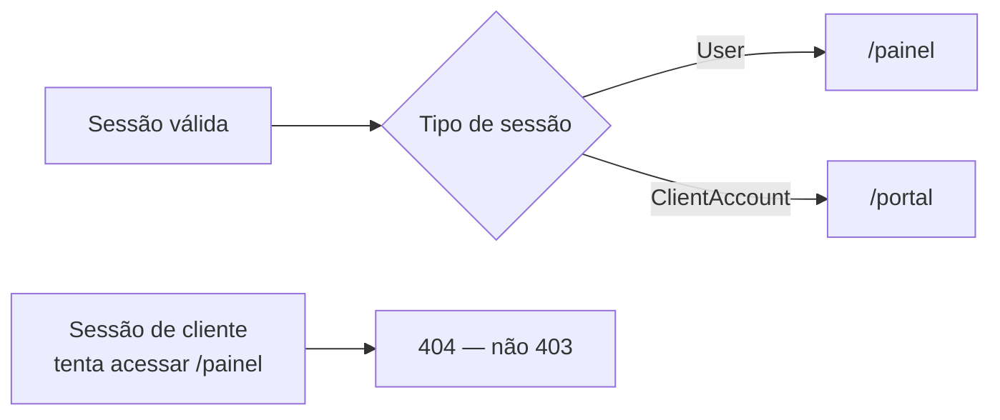

**404 em vez de 403** de propósito: 403 confirma que a rota existe. Para uma sessão
de cliente, o painel simplesmente não existe.

---

## 4. Os pontos de encontro

A parte que faz os dois aplicativos serem um produto só.

### E-01 · Autocadastro aparece no painel

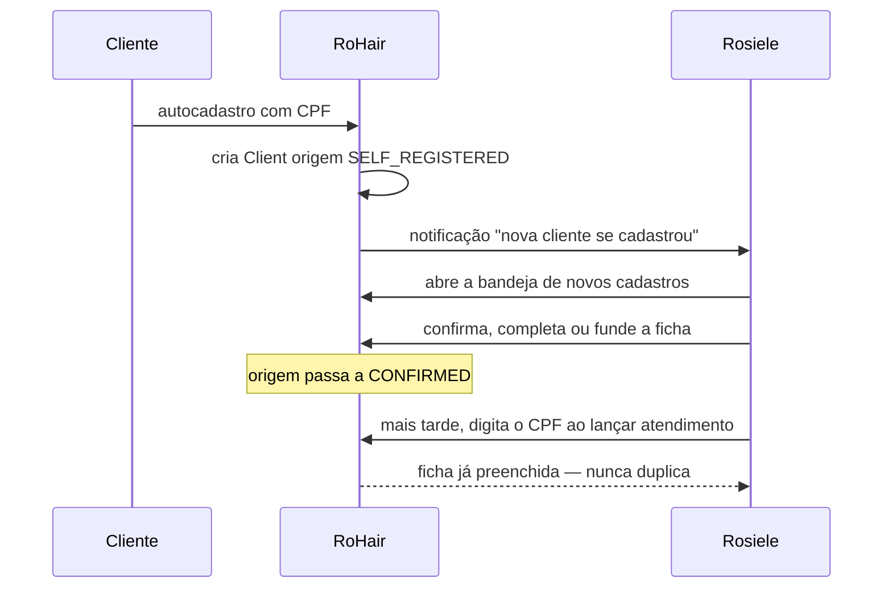

A ficha autocadastrada precisa ser **visualmente distinta** no painel até a Rosiele
confirmar. Dado que entrou sozinho no sistema não pode se misturar ao dado que ela
mesma conferiu.

### E-02 · Atendimento aparece no portal

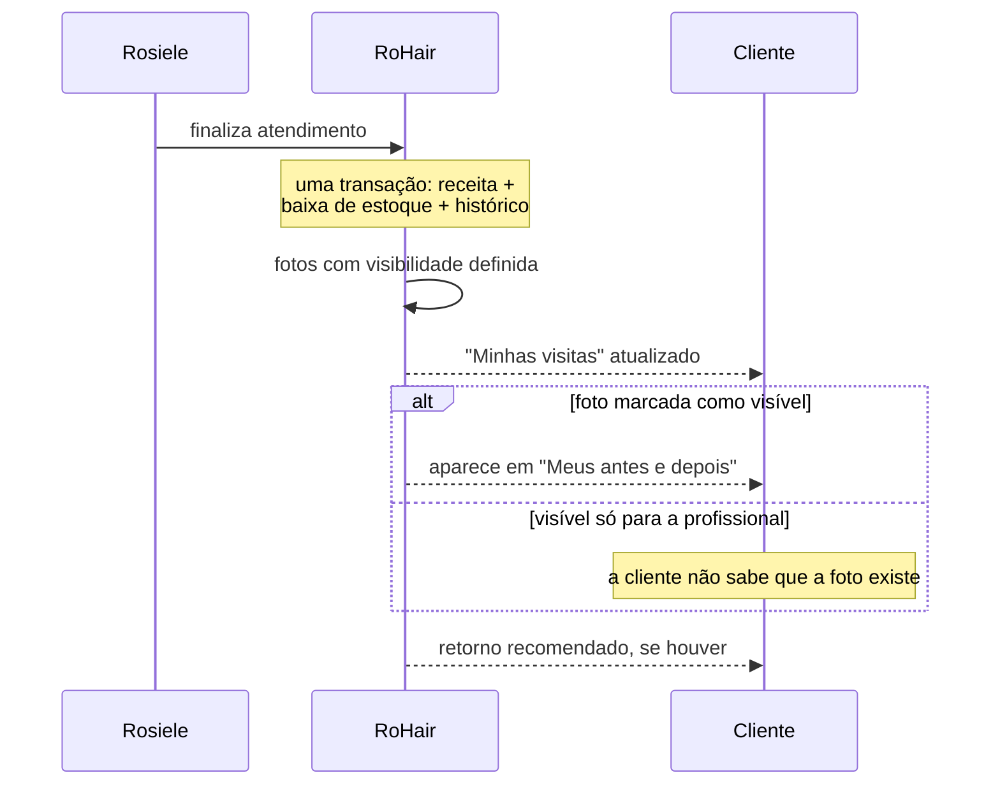

**A visibilidade da foto é decisão da Rosiele, por foto, no momento do
atendimento** — nunca um padrão global. Uma foto de "antes" que a cliente odiou
não pode aparecer no app dela por omissão.

### E-03 · Revogação de acesso

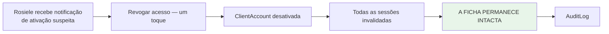

Revogar o acesso **nunca** apaga a ficha. São a credencial e o registro de negócio,
duas coisas separadas — é exatamente para isto que a separação existe.

---

## 5. Estados

### Origem da ficha

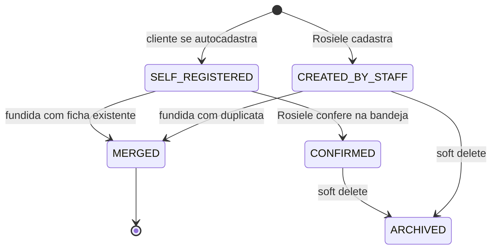

### Conta da cliente

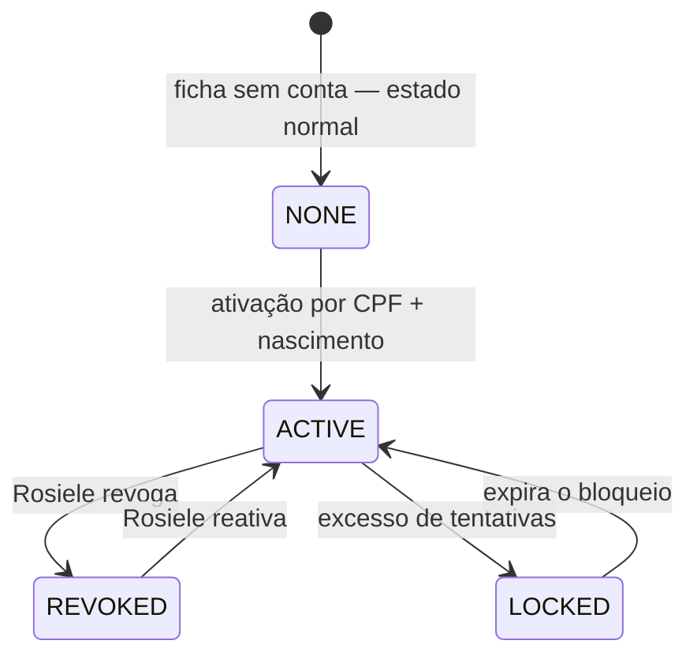

`NONE` **é o estado normal**, não um estado incompleto. A maioria das clientes da
Rosiele nunca vai abrir o app, e o produto tem que funcionar perfeitamente para
elas. Se o painel tratar "sem conta" como pendência, ele vai ficar cheio de alertas
falsos.

---

## 6. Três buracos encontrados ao escrever este documento

Estes achados são o motivo pelo qual esta etapa veio antes dos wireframes.

### ACHADO-01 · O ponto de encontro depende de um CPF que talvez não exista ⚠️ crítico

A DEC-008 supõe que a ficha tem CPF. Percorrendo o fluxo, isso não se sustenta: a
Rosiele atende clientes hoje e **não pede CPF de ninguém**. As fichas que ela
cadastrar terão nome e telefone.

Consequência: a cliente se autocadastra com CPF, o sistema procura o `cpfHash`, não
encontra — e **cria uma ficha nova**, duplicando alguém que já era cliente. A saída
1 do F-04, o momento mais valioso do produto, nunca acontece. As duas pontas não se
encontram.

Três caminhos, nenhum indolor:

| Caminho                                                                                                                           | Custo                                                         | Risco                                                                                                                    |
| --------------------------------------------------------------------------------------------------------------------------------- | ------------------------------------------------------------- | ------------------------------------------------------------------------------------------------------------------------ |
| **CPF obrigatório na ficha**                                                                                                      | Fricção no cadastro; ela vai ter que pedir CPF a cada cliente | Ela simplesmente não pede, e o campo fica vazio na marra                                                                 |
| **Casar por telefone como segunda chave**                                                                                         | Índice e fluxo de fusão adicionais                            | Telefone muda e é reutilizado; casamento errado expõe histórico de outra pessoa — **inaceitável sem confirmação humana** |
| **Fusão assistida** — autocadastro sempre cria ficha nova, e o painel sugere candidatas por nome e telefone para a Rosiele fundir | Tela de fusão na Fase 6                                       | Depende de ela fazer a fusão, mas **nenhum dado vaza sem decisão humana**                                                |

**Minha recomendação: o terceiro, combinado com CPF opcional mas pedido com
insistência no cadastro.** É o único em que um erro de casamento não expõe o
histórico de uma pessoa para outra. A fusão é uma ação consciente da Rosiele, que
conhece as clientes pelo nome — ela é o melhor algoritmo de desambiguação
disponível, e é grátis.

Isso torna a **fusão de fichas uma funcionalidade de primeira classe da Fase 6**,
não um detalhe. E torna o índice único de CPF **parcial** (`WHERE cpf_hash IS NOT
NULL`), o que muda o schema da Fase 3.

Vira decisão pendente **D-07**.

### ACHADO-02 · A data de nascimento tem o mesmo problema, e é pior

A ativação exige CPF **e** data de nascimento conferindo. Se a Rosiele cadastrou a
cliente sem data de nascimento, nem o CPF salva: a comparação não tem contra o quê
comparar.

Pior que o ACHADO-01, porque aqui a ficha **existe e foi encontrada** — e mesmo
assim a ativação falha, com uma mensagem genérica que não explica nada. A cliente
não tem como saber que o problema é um campo vazio no cadastro dela.

Mitigação: quando a ficha existe mas não tem data de nascimento, o fluxo não pode
simplesmente negar. Deve **encaminhar para aprovação manual da Rosiele** — "pedimos
para a Rosiele liberar seu acesso" — com notificação de um toque no painel. Isso
transforma um beco sem saída em uma espera de minutos.

Vira decisão pendente **D-08**.

### ACHADO-03 · Erro de digitação da Rosiele vira bloqueio permanente da cliente

Se a data de nascimento na ficha estiver digitada errada, a cliente **nunca**
consegue ativar. Ela digita a data correta, o sistema compara com a errada, nega,
conta a tentativa e a bloqueia progressivamente. Do lado dela, é um app quebrado
sem explicação.

Mesma mitigação do ACHADO-02: a rota de escape pela Rosiele resolve os dois. O que
o ACHADO-03 acrescenta é que **a notificação de tentativa falha também precisa
chegar ao painel** — não só a de sucesso. Sem isso, a Rosiele nunca fica sabendo
que uma cliente está batendo na porta.

Detalhe importante: notificar tentativa falha vaza para a Rosiele que alguém tentou
entrar com aquele CPF. Como a organização é dela e as clientes são dela, é
aceitável — mas a notificação não pode incluir a data de nascimento tentada, ou
vira um oráculo para descobrir dado de terceiros.

---

## 7. O que ainda depende da Rosiele

| #   | Pergunta                                    | Resolve                                                                                 |
| --- | ------------------------------------------- | --------------------------------------------------------------------------------------- |
| F-a | Ela agenda direto ou aprova solicitação?    | [D-05](04-DECISOES.md#d-05--poder-de-agendamento-da-cliente-no-portal) · roteiro 73, 74 |
| F-b | O que a cliente **não** pode ver?           | [D-06](04-DECISOES.md#d-06--escopo-do-portal-da-cliente) · roteiro 75                   |
| F-c | Ela tem CPF das clientes hoje?              | D-07 · roteiro 20, 51                                                                   |
| F-d | Ela sabe a data de nascimento das clientes? | D-08 · roteiro 57                                                                       |
| F-e | Alguém mais mexe no sistema?                | F-03 · roteiro 4                                                                        |
