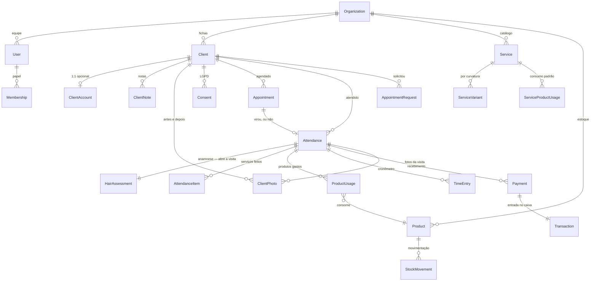
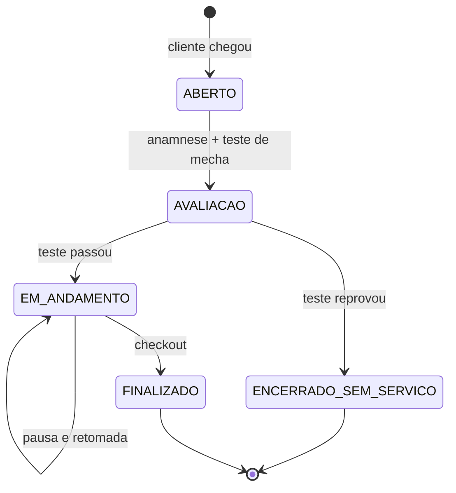

# Modelo de domínio — v1

> **Entregáveis 1.4 e 1.6 da Fase 1.** Validado contra
> [cinco cenários](10-CENARIOS.md), que expuseram **cinco buracos** — todos
> corrigidos aqui. É esta versão que vira schema Prisma na Fase 3.
>
> Duas fontes o formaram: as decisões já registradas, e a
> [conversa com a Roziele](descoberta/leitura-01.md), que trouxe `HairAssessment`
> e o portão do teste de mecha. Nada aqui depende de perguntar a alguém como
> trabalha — o que varia por profissional é
> [configuração](09-CONFIGURACAO.md), não modelo.

| Marca | Significa                                                                  |
| ----- | -------------------------------------------------------------------------- |
| 🔒    | **Travado** por decisão registrada. Não se rediscute sem revogar a decisão |
| 🗣️    | Veio da conversa com a Roziele                                             |
| ⚠️    | Hipótese do domínio, não confirmada por uso real                           |

---

## 1. Visão geral



---

## 2. Agregados e fronteiras

Um agregado é a unidade que se salva junta e cujas invariantes valem juntas.
Escolher errado as fronteiras é o erro mais caro do modelo: agregado grande demais
trava concorrência, pequeno demais espalha regra de negócio pelo código.

| Agregado        | Raiz            | Contém                                                                     | Por que esta fronteira                                                                                                                  |
| --------------- | --------------- | -------------------------------------------------------------------------- | --------------------------------------------------------------------------------------------------------------------------------------- |
| **Ficha**       | `Client`        | `ClientNote`, `ClientPhoto`, `Consent`                                     | Foto e nota não fazem sentido fora da cliente, e nunca são consultadas isoladas                                                         |
| **Conta**       | `ClientAccount` | —                                                                          | 🔒 Separado da ficha por DEC-008. Fundir traria a credencial para dentro do registro de negócio, que é exatamente o que a decisão evita |
| **Equipe**      | `User`          | `Membership`                                                               | —                                                                                                                                       |
| **Catálogo**    | `Service`       | `ServiceVariant`, `ServiceProductUsage`                                    | Preço, duração e consumo padrão mudam juntos                                                                                            |
| **Produto**     | `Product`       | —                                                                          | `StockMovement` fica **fora**: é um registro imutável append-only, e prendê-lo ao produto criaria contenção de escrita                  |
| **Agendamento** | `Appointment`   | —                                                                          | Curto, muito reescrito, alta concorrência                                                                                               |
| **Atendimento** | `Attendance`    | `HairAssessment`, `AttendanceItem`, `ProductUsage`, `TimeEntry`, `Payment` | ⚠️ A fronteira mais delicada. Ver seção 4                                                                                               |
| **Financeiro**  | `Transaction`   | —                                                                          | Livro-caixa append-only                                                                                                                 |

---

## 3. Value objects

Regras que valem em qualquer lugar do sistema, encapsuladas em tipos que tornam o
estado inválido irrepresentável.

| VO            | Regra                                                                                                                               |
| ------------- | ----------------------------------------------------------------------------------------------------------------------------------- |
| `Money` 🔒    | Centavos em `Int`. Nunca ponto flutuante. Só formata na borda                                                                       |
| `Cpf` 🔒      | 11 dígitos, validado pelos dígitos verificadores, normalizado. Expõe `hash()` e `encrypted()`, **nunca** o valor cru em log ou erro |
| `TimeRange`   | Início e fim em UTC. `end > start` sempre. Sabe dizer se intersecta outro                                                           |
| `Duration`    | Minutos, positivo                                                                                                                   |
| `PhoneNumber` | E.164 normalizado, com formatação brasileira na exibição                                                                            |
| `Quantity`    | Quantidade + unidade. 🗣️ Frasco e aplicação primeiro; conversão interna                                                             |

---

## 4. As decisões de modelagem que sustentam tudo

### 4.1 Agendamento e atendimento são entidades distintas 🔒

Já argumentado no [glossário](06-GLOSSARIO.md#uma-distinção-que-precisa-sobreviver-ao-projeto-inteiro).
Em resumo: `Appointment` é a intenção, `Attendance` é o fato. A relação é 0..1 para
0..1, nos **dois** sentidos.

| Situação                | Appointment       | Attendance |
| ----------------------- | ----------------- | ---------- |
| Visita normal           | existe            | existe     |
| Encaixe                 | não existe        | existe     |
| Falta                   | existe            | não existe |
| Cancelamento antecipado | existe, cancelado | não existe |

Nenhuma dessas quatro é exceção — as quatro acontecem toda semana. Um modelo que
trate encaixe ou falta como caso especial já nasce errado.

### 4.2 A anamnese abre o atendimento, e pode impedi-lo 🗣️

**Entidade que não existia na v0.** Veio da primeira rodada, e é a mudança mais
importante desta versão.

A Roziele descreveu a mesma sequência de perguntas duas vezes, em blocos
diferentes, sem que nada pedisse isso:

```
HairAssessment
  attendanceId
  hasChemistry        já fez algum alisamento?
  previousProduct     qual produto utilizou?
  lastStraightenedAt  qual a última vez que alisou
  isBreaking          está quebrando?
  isFalling           está caindo?
  strandTestResult    PASSED | FAILED | NOT_APPLICABLE
  strandTestedAt
```

**Por que não é uma `ClientNote`.** Eu tinha modelado isso como texto livre com um
tipo `SAFETY` hipotético. Texto livre não dispara alerta, não se compara entre
visitas e não responde "quantas clientes chegaram com o cabelo caindo". Isto é um
formulário fixo, repetido, idêntico a cada visita — e **decide se o serviço pode
acontecer**. Merece estrutura.

**Por que pertence ao atendimento e não à ficha.** "Qual a última vez que alisou"
muda a cada retorno. Se morasse na `Client`, seria um campo mutável sobrescrito a
cada visita, e o histórico se perderia — justamente o histórico que evita
sobrepor química incompatível. A ficha **exibe a anamnese mais recente**; nunca
guarda uma cópia própria.

> **INV-16** — atendimento com **serviço químico** tem exatamente uma
> `HairAssessment`, criada na abertura. Fora disso ela é opcional e segue a
> configuração da profissional: quem só faz corte nunca vê essa tela.

⚠️ A primeira versão desta invariante exigia anamnese em **todo** atendimento, o
que contradizia a configuração e obrigaria uma escova simples a passar por
avaliação química. Corrigido por [GAP-05](10-CENARIOS.md).

### 4.3 O teste de mecha é um portão que pode reprovar 🗣️

> _"Inicio fazendo teste de mecha pra ver se o cabelo suporta o produto."_

Um teste que existe para verificar é um teste que pode falhar. Quando falha, a
progressiva **não acontece** — mas a cliente veio, o horário foi ocupado e trabalho
foi feito.

A v0 ia de iniciado a finalizado, supondo que o serviço planejado é o executado.
Faltava isto:



`ENCERRADO_SEM_SERVICO` não é erro nem cancelamento: é **desfecho legítimo e
seguro**, e provavelmente o momento em que ela mais protege a cliente. O painel
deve tratá-lo como trabalho bem feito, nunca como falha.

**Ele consome produto.** O teste de mecha gasta um pouco do que estava sendo
testado, então há `ProductUsage` e há baixa de estoque — custo sem receita, que é a
verdade do que aconteceu. O que não existe é `AttendanceItem` do serviço impedido
(INV-17).

Esta é a resposta ao caso 2 do roteiro — "um atendimento que deu errado" — que ela
respondeu com _"kkkkkkkkk nunca deu"_. Ela está certa: para ela isso é
procedimento normal. É o modelo que precisava enxergar.

**Se gera cobrança é política dela**, não do produto: vira chave de configuração
(M-11). O estado existe sempre — reprovar não pode depender de a profissional ter
configurado alguma coisa.

### 4.4 O cronômetro é uma lista imutável de intervalos 🔒

```
TimeEntry: attendanceId · startedAt · endedAt (nulo enquanto corre) · reason
```

Pausar fecha o intervalo aberto. Retomar abre um novo. O tempo total é a soma.

**Por quê:** guardar `startedAt` + `pausedDuration` mutável perde tudo se o app
fechar no meio — e fechar o app no meio é o cenário normal, não o excepcional. Com
intervalos, o estado vive no banco a cada transição e o histórico fica auditável:
dá para responder "quanto tempo essa progressiva levou de verdade, sem contar a
pausa do almoço?".

> **INV-06** — dois `TimeEntry` do mesmo atendimento nunca se sobrepõem.
> **INV-07** — no máximo um `TimeEntry` com `endedAt` nulo por atendimento.

### 4.5 Serviço composto: preço no pai, custo nas folhas 🗣️

`AttendanceItem` referencia a si mesmo por `parentItemId`. Um atendimento de
"escova com nutrição" grava o item pai, com o preço, e as etapas como filhas, com o
consumo.

| Nível       | Carrega                                                 |
| ----------- | ------------------------------------------------------- |
| Item pai    | `unitPriceCents` — o que a cliente paga                 |
| Itens folha | `ProductUsage` e o custo — o que a baixa de estoque usa |

**Por quê.** O preço é do pacote; o consumo é da etapa. Gravar só o pai não dá
baixa em nada, porque o consumo padrão está nas etapas. Gravar só as folhas perde o
preço ou obriga a ratear por chute, e a margem por serviço vira ficção.

> **INV-19** — o preço vive no pai, o custo e a baixa vivem nas folhas. Nunca nos
> dois, ou o valor é contado em dobro.

Descoberto pelo [cenário 3](10-CENARIOS.md#cenário-3--o-encaixe-que-virou-três-coisas).
Sem isso, o DoD da Fase 7 — _"finalizar dá baixa automática correta"_ — falharia em
silêncio no caso mais comum da Roziele.

### 4.6 Preço é congelado no atendimento 🔒

`AttendanceItem` guarda `unitPriceCents` copiado do serviço no momento do
lançamento — nunca uma referência viva ao preço atual.

**Por quê:** reajustar a escova de R$ 80 para R$ 90 não pode reescrever o
faturamento de março. O DoD da Fase 10 exige que o relatório do mês bata ao
centavo; sem snapshot, ele muda toda vez que ela mexe no catálogo.

O mesmo vale para o custo do produto em `ProductUsage`: `unitCostCents` é copiado,
senão a margem histórica dança quando o fornecedor aumenta o preço.

### 4.7 Estoque negativo é permitido, e é intencional ⚠️

Se o registro diz 2 frascos e ela usou 3, a verdade é 3. O sistema **não** pode
recusar a baixa nem travar a finalização do atendimento.

**Por quê:** o princípio de honestidade de estado
([01-VISAO-PRODUTO.md](01-VISAO-PRODUTO.md)) vale para o estoque. Bloquear a baixa
obrigaria a Roziele a mentir para o app com a cliente na cadeira, e no minuto em
que ela mente uma vez o estoque inteiro deixa de valer. Melhor aceitar o negativo e
sinalizar: "o registro está atrás da realidade, quer acertar?".

### 4.8 O que existe sem organização: nada 🔒

> **INV-12** — toda entidade tem `organizationId`, injetado por Prisma Client
> Extension e protegido por RLS. Não há exceção, nem em tabela de apoio.

---

## 5. Invariantes — o banco de testes da Fase 3

Cada uma vira um teste unitário que roda sem banco, em milissegundos. Esta lista é
o contrato entre a Fase 1 e a Fase 3.

| #      | Invariante                                                                                                                                 | Onde é garantida                                          |
| ------ | ------------------------------------------------------------------------------------------------------------------------------------------ | --------------------------------------------------------- |
| INV-01 | Dois agendamentos do mesmo profissional nunca se sobrepõem                                                                                 | 🔒 `EXCLUDE USING gist` — banco. A checagem na UI é só UX |
| INV-02 | CPF inválido pelos dígitos verificadores nunca é gravado                                                                                   | VO `Cpf`                                                  |
| INV-03 | `cpfHash` é único por organização — **índice parcial**, `WHERE cpf_hash IS NOT NULL`                                                       | Banco · D-07                                              |
| INV-04 | Todo valor monetário é `Int` em centavos                                                                                                   | VO `Money`                                                |
| INV-05 | Preço e custo são snapshot, nunca referência viva                                                                                          | `AttendanceItem`, `ProductUsage`                          |
| INV-06 | Intervalos de cronômetro não se sobrepõem                                                                                                  | Agregado `Attendance`                                     |
| INV-07 | No máximo um intervalo aberto por atendimento                                                                                              | Agregado `Attendance`                                     |
| INV-08 | Atendimento finalizado é imutável; correção é um lançamento de ajuste, com autor e motivo                                                  | Agregado `Attendance`                                     |
| INV-09 | Finalizar gera receita, baixa de estoque e histórico **numa única transação**                                                              | 🔒 DoD da Fase 9                                          |
| INV-10 | `ClientAccount` pertence a exatamente uma `Client`; `Client` tem no máximo uma conta                                                       | 🔒 DEC-008                                                |
| INV-11 | Toda foto nasce com visibilidade explícita, padrão **só a profissional**                                                                   | Agregado `Client`                                         |
| INV-12 | Toda entidade tem `organizationId`                                                                                                         | Extension + RLS                                           |
| INV-13 | Toda data é UTC no banco; fuso vive na organização                                                                                         | 🔒 Arquitetura                                            |
| INV-14 | Revogar conta nunca altera a ficha                                                                                                         | Fronteira de agregados                                    |
| INV-15 | Soft delete de cliente preserva o histórico financeiro, que é imutável                                                                     | Agregado `Transaction`                                    |
| INV-16 | Atendimento com **serviço químico** tem exatamente uma `HairAssessment`, e o teste de mecha é etapa dela. Fora disso, segue a configuração | 🗣️ Corrigida por [GAP-05](10-CENARIOS.md)                 |
| INV-17 | Teste reprovado nunca gera `AttendanceItem` do serviço impedido — mas **gera `ProductUsage`** do que o teste consumiu                      | 🗣️ Corrigida por [GAP-01](10-CENARIOS.md)                 |
| INV-18 | O atendimento pertence ao dia da **finalização**, no fuso da organização. Um só instante decide receita, baixa e histórico                 | [GAP-04](10-CENARIOS.md)                                  |
| INV-19 | Em serviço composto, o **preço** vive no item pai e o **custo e a baixa** vivem nas folhas. Nunca nos dois                                 | [GAP-02](10-CENARIOS.md)                                  |
| INV-20 | Fundir fichas que ambas têm conta deixa ativa a de login mais recente; a outra é **revogada, nunca apagada**, com registro em `AuditLog`   | [GAP-03](10-CENARIOS.md)                                  |

### Três cenários adversariais que a v1 precisa passar

Além dos cinco casos reais da Roziele, o modelo tem que sobreviver a:

1. **Corrida de agendamento** — duas requisições simultâneas no mesmo horário. Uma
   tem que falhar no banco, não na aplicação (INV-01).
2. **App fechado no meio do atendimento** — reabrir mostra o cronômetro correto,
   sem perder um segundo (INV-06, INV-07).
3. **Reajuste de preço retroativo** — mudar o preço da escova hoje não altera
   nenhum relatório de mês fechado (INV-05).

---

## 6. Notas por entidade

Só onde há algo não óbvio.

**`Client`** — `cpfHash` e `cpfEncrypted` 🔒, ambos **opcionais** (D-07). `birthDate`
opcional, com a rota de escape da D-08 quando faltar. `origin` conforme a máquina de
estados dos [fluxos](07-FLUXOS.md#5-estados). `mergedIntoId` para fusão sem perda de
histórico. 🗣️ `curvature` como lista de nomes — liso, ondulado, cacheado, crespo —
nunca notação `3B`.

**`ClientNote`** — carimbo de data e autor, sempre, mais `visibility` para o portal
(configurável, padrão privado). O alerta de química **não** é nota: vive na
`HairAssessment` e aparece antes de iniciar o atendimento, não enterrado no
histórico.

**`ClientPhoto`** — `kind: BEFORE | AFTER | REFERENCE`. A terceira existe porque a
cliente manda foto de referência — e referência não é antes nem depois.
`visibility: PROFESSIONAL_ONLY | CLIENT_VISIBLE`, padrão o primeiro (INV-11).

**`Service` e `ServiceVariant`** — a variante é **opcional e nasce desligada**: quem
cobra preço único nunca vê essa complexidade. 🗣️ Quando ligada, o eixo padrão é
**curvatura**. Serviço composto por `ServiceStep`, com o consumo padrão nas etapas
(INV-19).

**`Attendance`** — `AttendanceItem` **sempre em lista**, com `parentItemId` para
serviço composto. Sem invariante de atendimento único: o modelo permite dois em
andamento, a interface começa com um
([09-CONFIGURACAO.md § 5](09-CONFIGURACAO.md#5-o-que-não-é-configurável)).

**`Payment`** — lista, permitindo dividido e parcial. Fiado e cortesia são estados
de primeira classe desde já; a interface os esconde de quem não usa.

**`StockMovement`** — append-only, com `reason: PURCHASE | USAGE | LOSS |
ADJUSTMENT | EXPIRY`. A quantidade atual é derivada da soma, nunca um campo
mutável — assim toda movimentação é rastreável até a origem, que é DoD da Fase 7.
A baixa por atendimento é calculada sobre as **folhas** dos itens (INV-19).

**`Insight`** — regra versionada, com `dismissedAt`. As duas primeiras regras já são
deriváveis do que sabemos: 🗣️ **retorno vencido** (serviço + curvatura) e
**produto acabando** — que juntas atacam a frase do fim do mês. As demais nascem do
uso, na Fase 11.

---

## 7. As perguntas do modelo — todas resolvidas

Nenhuma delas foi resolvida perguntando à Roziele. Por
[DEC-013](04-DECISOES.md#dec-013), a pergunta certa deixou de ser "o que ela faz?" e
passou a ser **"quem sabe a resposta?"** — e a resposta manda a questão para a
arquitetura, para a tela de configuração ou para o próprio uso.

| #    | Pergunta                             | Resolução                                                                                            | Onde vive       |
| ---- | ------------------------------------ | ---------------------------------------------------------------------------------------------------- | --------------- |
| M-01 | Um serviço por visita ou vários?     | **Sempre lista.** Serviço composto permite montar nutrição como etapa da escova ou como item à parte | 🏛️ Arquitetura  |
| M-02 | Atende duas clientes ao mesmo tempo? | **Modelo permite, interface começa com uma.** Sem invariante de atendimento único                    | 🏛️ Arquitetura  |
| M-03 | Trabalha com cronograma capilar?     | Serviço composto + intervalo de retorno cobrem o caso sem entidade nova                              | ⚙️ Configuração |
| M-04 | Tem cliente fixa quinzenal?          | Recorrência como opção do agendamento, desligada por padrão                                          | ⚙️ Configuração |
| M-05 | Pensa estoque em quê?                | **Frasco e aplicação primeiro**, conversão interna                                                   | ⚙️ Configuração |
| M-06 | Cliente já ficou devendo?            | `Payment` em lista desde sempre; fiado escondido até ser usado                                       | 🏛️ Arquitetura  |
| M-07 | Atende de graça alguém?              | Cortesia é estado próprio, nunca "não pago"                                                          | 🏛️ Arquitetura  |
| M-08 | Precisa saber a química anterior?    | ✅ **Sim — portão de segurança.** Gerou `HairAssessment` e `ENCERRADO_SEM_SERVICO`                   | 🗣️ Da conversa  |
| M-09 | Preço varia por cabelo?              | `ServiceVariant` opcional, eixo padrão **curvatura**                                                 | ⚙️ Configuração |
| M-10 | Quando as mãos ficam livres?         | Não se pergunta — **se mede**. O cronômetro mostra a janela real                                     | 📈 Aprendizado  |
| M-11 | Teste reprovado gera cobrança?       | O estado existe sempre; cobrar é política dela                                                       | ⚙️ Configuração |
| M-12 | Trabalha sozinha?                    | `Membership` desde a Fase 3; interface só com mais de uma pessoa                                     | 🏛️ Arquitetura  |

**Legenda:** 🏛️ decidido na arquitetura, não é configurável ·
⚙️ [tela de configuração](09-CONFIGURACAO.md) · 📈 o sistema aprende ·
🗣️ veio da conversa

Detalhamento das decisões de arquitetura em
[09-CONFIGURACAO.md § 5](09-CONFIGURACAO.md#5-o-que-não-é-configurável).

---

## 8. O que acontece agora

1. ✅ Conversa com a Roziele lida — [leitura](descoberta/leitura-01.md). Gerou
   `HairAssessment`, `ENCERRADO_SEM_SERVICO` e o vocabulário
2. ✅ M-01 a M-12 resolvidas por arquitetura, configuração ou aprendizado
   ([DEC-013](04-DECISOES.md#dec-013)) — **não haverá segunda rodada**
3. ⬜ Validação contra cinco cenários de atendimento, construídos do domínio e do
   que ela contou — DoD da Fase 1
4. ⬜ Promoção a **v1** e, só então, schema Prisma na Fase 3
