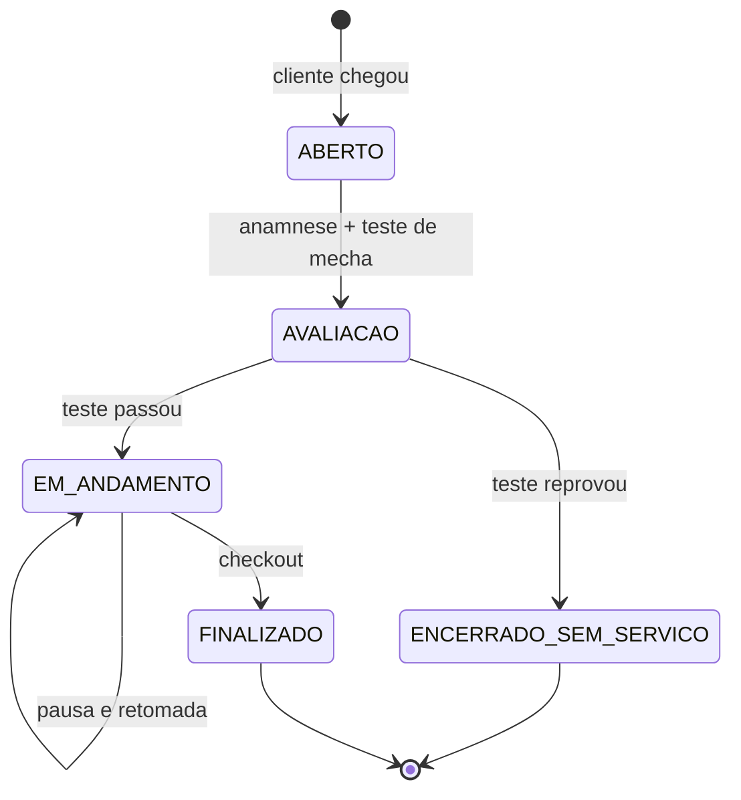

# Modelo de domínio — v0.5

> **Entregável 1.4 da Fase 1.** 🚧 **Este documento é um rascunho feito para ser
> destruído.** Atualizado com a primeira rodada de respostas da Rosiele — ver
> [leitura-01.md](descoberta/leitura-01.md).
>
> Ele deriva apenas do que já está decidido — não da realidade da Rosiele, que
> ainda não foi ouvida. Sua função não é estar certo: é **ser específico o
> suficiente para estar errado de um jeito visível**, e assim gerar as perguntas
> certas.
>
> Um modelo vago sobrevive a qualquer entrevista porque não afirma nada. Este
> afirma. Na Fase 1B ele é confrontado com cinco atendimentos reais e reescrito
> como **v1**; só a v1 vira schema Prisma na Fase 3.

| Marca | Significa |
| ----- | --------- |
| 🔒 | **Travado** por decisão registrada. Não se rediscute sem revogar a decisão |
| ⚠️ | **Hipótese minha.** Pode cair inteira depois da conversa |
| ❓ | **Depende de resposta.** A pergunta está na seção 7 |

---

## 1. Visão geral


---

## 2. Agregados e fronteiras

Um agregado é a unidade que se salva junta e cujas invariantes valem juntas.
Escolher errado as fronteiras é o erro mais caro do modelo: agregado grande demais
trava concorrência, pequeno demais espalha regra de negócio pelo código.

| Agregado | Raiz | Contém | Por que esta fronteira |
| -------- | ---- | ------ | ---------------------- |
| **Ficha** | `Client` | `ClientNote`, `ClientPhoto`, `Consent` | Foto e nota não fazem sentido fora da cliente, e nunca são consultadas isoladas |
| **Conta** | `ClientAccount` | — | 🔒 Separado da ficha por DEC-008. Fundir traria a credencial para dentro do registro de negócio, que é exatamente o que a decisão evita |
| **Equipe** | `User` | `Membership` | — |
| **Catálogo** | `Service` | `ServiceVariant`, `ServiceProductUsage` | Preço, duração e consumo padrão mudam juntos |
| **Produto** | `Product` | — | `StockMovement` fica **fora**: é um registro imutável append-only, e prendê-lo ao produto criaria contenção de escrita |
| **Agendamento** | `Appointment` | — | Curto, muito reescrito, alta concorrência |
| **Atendimento** | `Attendance` | `HairAssessment`, `AttendanceItem`, `ProductUsage`, `TimeEntry`, `Payment` | ⚠️ A fronteira mais delicada. Ver seção 4 |
| **Financeiro** | `Transaction` | — | Livro-caixa append-only |

---

## 3. Value objects

Regras que valem em qualquer lugar do sistema, encapsuladas em tipos que tornam o
estado inválido irrepresentável.

| VO | Regra |
| -- | ----- |
| `Money` 🔒 | Centavos em `Int`. Nunca ponto flutuante. Só formata na borda |
| `Cpf` 🔒 | 11 dígitos, validado pelos dígitos verificadores, normalizado. Expõe `hash()` e `encrypted()`, **nunca** o valor cru em log ou erro |
| `TimeRange` | Início e fim em UTC. `end > start` sempre. Sabe dizer se intersecta outro |
| `Duration` | Minutos, positivo |
| `PhoneNumber` | E.164 normalizado, com formatação brasileira na exibição |
| `Quantity` ❓ | Quantidade + unidade. A unidade depende de M-05 |

---

## 4. As decisões de modelagem que sustentam tudo

### 4.1 Agendamento e atendimento são entidades distintas 🔒

Já argumentado no [glossário](06-GLOSSARIO.md#uma-distinção-que-precisa-sobreviver-ao-projeto-inteiro).
Em resumo: `Appointment` é a intenção, `Attendance` é o fato. A relação é 0..1 para
0..1, nos **dois** sentidos.

| Situação | Appointment | Attendance |
| -------- | ----------- | ---------- |
| Visita normal | existe | existe |
| Encaixe | não existe | existe |
| Falta | existe | não existe |
| Cancelamento antecipado | existe, cancelado | não existe |

Nenhuma dessas quatro é exceção — as quatro acontecem toda semana. Um modelo que
trate encaixe ou falta como caso especial já nasce errado.

### 4.2 A anamnese abre o atendimento, e pode impedi-lo 🗣️

**Entidade que não existia na v0.** Veio da primeira rodada, e é a mudança mais
importante desta versão.

A Rosiele descreveu a mesma sequência de perguntas duas vezes, em blocos
diferentes, sem que nada pedisse isso:

```
HairAssessment
  attendanceId
  hasChemistry        já fez algum alisamento?
  previousProduct     qual produto utilizou?
  lastStraightenedAt  qual a última vez que alisou
  isBreaking          está quebrando?
  isFalling           está caindo?
  strandTestResult    PASSED | FAILED | NOT_APPLICABLE
  strandTestedAt
```

**Por que não é uma `ClientNote`.** Eu tinha modelado isso como texto livre com um
tipo `SAFETY` hipotético. Texto livre não dispara alerta, não se compara entre
visitas e não responde "quantas clientes chegaram com o cabelo caindo". Isto é um
formulário fixo, repetido, idêntico a cada visita — e **decide se o serviço pode
acontecer**. Merece estrutura.

**Por que pertence ao atendimento e não à ficha.** "Qual a última vez que alisou"
muda a cada retorno. Se morasse na `Client`, seria um campo mutável sobrescrito a
cada visita, e o histórico se perderia — justamente o histórico que evita
sobrepor química incompatível. A ficha **exibe a anamnese mais recente**; nunca
guarda uma cópia própria.

> **INV-16** — todo `Attendance` tem exatamente uma `HairAssessment`, criada na
> abertura. Não existe atendimento sem anamnese.

### 4.3 O teste de mecha é um portão que pode reprovar 🗣️

> *"Inicio fazendo teste de mecha pra ver se o cabelo suporta o produto."*

Um teste que existe para verificar é um teste que pode falhar. Quando falha, a
progressiva **não acontece** — mas a cliente veio, o horário foi ocupado e trabalho
foi feito.

A v0 ia de iniciado a finalizado, supondo que o serviço planejado é o executado.
Faltava isto:



`ENCERRADO_SEM_SERVICO` não é erro nem cancelamento: é **desfecho legítimo e
seguro**, e provavelmente o momento em que ela mais protege a cliente. O painel
deve tratá-lo como trabalho bem feito, nunca como falha.

Esta é a resposta ao caso 2 do roteiro — "um atendimento que deu errado" — que ela
respondeu com *"kkkkkkkkk nunca deu"*. Ela está certa: para ela isso é
procedimento normal. É o modelo que precisava enxergar.

⚠️ **Duas perguntas abertas:** com que frequência reprova, e se ela cobra alguma
coisa quando reprova. Perguntas 21 a 23 da
[rodada 2](descoberta/roteiro-rosiele-02.md). A segunda decide se
`ENCERRADO_SEM_SERVICO` gera receita.

### 4.4 O cronômetro é uma lista imutável de intervalos 🔒

```
TimeEntry: attendanceId · startedAt · endedAt (nulo enquanto corre) · reason
```

Pausar fecha o intervalo aberto. Retomar abre um novo. O tempo total é a soma.

**Por quê:** guardar `startedAt` + `pausedDuration` mutável perde tudo se o app
fechar no meio — e fechar o app no meio é o cenário normal, não o excepcional. Com
intervalos, o estado vive no banco a cada transição e o histórico fica auditável:
dá para responder "quanto tempo essa progressiva levou de verdade, sem contar a
pausa do almoço?".

> **INV-06** — dois `TimeEntry` do mesmo atendimento nunca se sobrepõem.
> **INV-07** — no máximo um `TimeEntry` com `endedAt` nulo por atendimento.

### 4.5 Preço é congelado no atendimento 🔒

`AttendanceItem` guarda `unitPriceCents` copiado do serviço no momento do
lançamento — nunca uma referência viva ao preço atual.

**Por quê:** reajustar a escova de R$ 80 para R$ 90 não pode reescrever o
faturamento de março. O DoD da Fase 10 exige que o relatório do mês bata ao
centavo; sem snapshot, ele muda toda vez que ela mexe no catálogo.

O mesmo vale para o custo do produto em `ProductUsage`: `unitCostCents` é copiado,
senão a margem histórica dança quando o fornecedor aumenta o preço.

### 4.6 Estoque negativo é permitido, e é intencional ⚠️

Se o registro diz 2 frascos e ela usou 3, a verdade é 3. O sistema **não** pode
recusar a baixa nem travar a finalização do atendimento.

**Por quê:** o princípio de honestidade de estado
([01-VISAO-PRODUTO.md](01-VISAO-PRODUTO.md)) vale para o estoque. Bloquear a baixa
obrigaria a Rosiele a mentir para o app com a cliente na cadeira, e no minuto em
que ela mente uma vez o estoque inteiro deixa de valer. Melhor aceitar o negativo e
sinalizar: "o registro está atrás da realidade, quer acertar?".

### 4.7 O que existe sem organização: nada 🔒

> **INV-12** — toda entidade tem `organizationId`, injetado por Prisma Client
> Extension e protegido por RLS. Não há exceção, nem em tabela de apoio.

---

## 5. Invariantes — o banco de testes da Fase 3

Cada uma vira um teste unitário que roda sem banco, em milissegundos. Esta lista é
o contrato entre a Fase 1 e a Fase 3.

| # | Invariante | Onde é garantida |
| - | ---------- | ---------------- |
| INV-01 | Dois agendamentos do mesmo profissional nunca se sobrepõem | 🔒 `EXCLUDE USING gist` — banco. A checagem na UI é só UX |
| INV-02 | CPF inválido pelos dígitos verificadores nunca é gravado | VO `Cpf` |
| INV-03 | `cpfHash` é único por organização — **índice parcial**, `WHERE cpf_hash IS NOT NULL` | Banco ❓ depende de D-07 |
| INV-04 | Todo valor monetário é `Int` em centavos | VO `Money` |
| INV-05 | Preço e custo são snapshot, nunca referência viva | `AttendanceItem`, `ProductUsage` |
| INV-06 | Intervalos de cronômetro não se sobrepõem | Agregado `Attendance` |
| INV-07 | No máximo um intervalo aberto por atendimento | Agregado `Attendance` |
| INV-08 | Atendimento finalizado é imutável; correção é um lançamento de ajuste, com autor e motivo | Agregado `Attendance` |
| INV-09 | Finalizar gera receita, baixa de estoque e histórico **numa única transação** | 🔒 DoD da Fase 9 |
| INV-10 | `ClientAccount` pertence a exatamente uma `Client`; `Client` tem no máximo uma conta | 🔒 DEC-008 |
| INV-11 | Toda foto nasce com visibilidade explícita, padrão **só a profissional** | Agregado `Client` |
| INV-12 | Toda entidade tem `organizationId` | Extension + RLS |
| INV-13 | Toda data é UTC no banco; fuso vive na organização | 🔒 Arquitetura |
| INV-14 | Revogar conta nunca altera a ficha | Fronteira de agregados |
| INV-15 | Soft delete de cliente preserva o histórico financeiro, que é imutável | Agregado `Transaction` |
| INV-16 | Todo `Attendance` tem exatamente uma `HairAssessment` | 🗣️ Agregado `Attendance` |
| INV-17 | Atendimento com teste de mecha reprovado nunca gera `ProductUsage` do produto reprovado nem `AttendanceItem` do serviço impedido | 🗣️ Agregado `Attendance` |

### Três cenários adversariais que a v1 precisa passar

Além dos cinco casos reais da Rosiele, o modelo tem que sobreviver a:

1. **Corrida de agendamento** — duas requisições simultâneas no mesmo horário. Uma
   tem que falhar no banco, não na aplicação (INV-01).
2. **App fechado no meio do atendimento** — reabrir mostra o cronômetro correto,
   sem perder um segundo (INV-06, INV-07).
3. **Reajuste de preço retroativo** — mudar o preço da escova hoje não altera
   nenhum relatório de mês fechado (INV-05).

---

## 6. Notas por entidade

Só onde há algo não óbvio.

**`Client`** — `cpfHash` e `cpfEncrypted` 🔒. `birthDate` ❓ obrigatório ou não
(ACHADO-02). `origin` conforme a máquina de estados dos [fluxos](07-FLUXOS.md#5-estados).
`mergedIntoId` para fusão sem perda de histórico (ACHADO-01). ⚠️ Campos de
caracterização do cabelo dependem de G-10.

**`ClientNote`** — carimbo de data e autor, sempre. ❓ Precisa de um campo de
visibilidade para o portal (roteiro 75) e ❓ possivelmente de um tipo especial
`SAFETY` para alerta de química (G-05), que não é nota — é aviso que aparece antes
de iniciar o atendimento.

**`ClientPhoto`** — `kind: BEFORE | AFTER | REFERENCE`. A terceira existe porque a
cliente manda foto de referência (roteiro 72) — e referência não é antes nem
depois. `visibility: PROFESSIONAL_ONLY | CLIENT_VISIBLE`, padrão o primeiro
(INV-11).

**`Service` e `ServiceVariant`** — ⚠️ a variante existe para comprimento e volume
do cabelo, que é a hipótese mais forte de precificação (roteiro 42). Se a Rosiele
cobra preço fixo, `ServiceVariant` **some do modelo** em vez de virar uma tabela
com uma linha só.

**`Attendance`** — ❓ **um serviço ou vários?** (M-01). Modelei com
`AttendanceItem` em lista, que suporta os dois casos; se ela nunca combina
serviços, a lista some e o modelo simplifica muito. ❓ **Um profissional ou
vários simultâneos?** (M-02) — se ela atende duas clientes ao mesmo tempo, o
cronômetro deixa de ser singular e o painel inteiro muda.

**`Payment`** — ⚠️ modelado como lista, permitindo pagamento dividido e parcial.
❓ Depende de M-06 e M-07: fiado e cortesia precisam ser estados de primeira
classe, ou o financeiro nunca fecha.

**`StockMovement`** — append-only, com `reason: PURCHASE | USAGE | LOSS |
ADJUSTMENT | EXPIRY`. A quantidade atual é derivada da soma, nunca um campo
mutável — assim toda movimentação é rastreável até a origem, que é DoD da Fase 7.

**`Insight`** — regra versionada, com `dismissedAt`. ⚠️ As regras concretas
dependem inteiramente do bloco 6 do roteiro; inventá-las agora seria adivinhação.

---

## 7. Perguntas que este modelo faz à Rosiele

Cada uma muda o modelo de forma visível. Esta tabela é o motivo de o v0 existir.

| # | Pergunta | Status depois da rodada 1 |
| - | -------- | ------------------------- |
| M-01 | Um serviço por visita ou vários? | 🟡 Nutrição e corte de pontas parecem **etapas da escova**, não itens vendidos. Se confirmar, `AttendanceItem` continua em lista mas o catálogo ganha serviços compostos · rodada 2, Partes A e B |
| M-02 | Atende duas clientes ao mesmo tempo? | ⬜ Sem resposta. Continua sendo a pergunta que mais muda o painel |
| M-03 | Trabalha com cronograma capilar? | ⬜ Sem resposta |
| M-04 | Tem cliente fixa quinzenal? | 🟡 Indireto: a progressiva tem **loop de 3 meses**. Não é recorrência de agenda, mas é recorrência de negócio — o retorno é previsível |
| M-05 | Pensa estoque em quê? | 🟡 **Frasco.** *"Um frasco dá para quantas progressivas"* é a pergunta 6 da rodada 2 |
| M-06 | Cliente já ficou devendo? | ⬜ Sem resposta · rodada 2, pergunta 11 |
| M-07 | Atende de graça alguém? | ⬜ Sem resposta |
| M-08 | Precisa saber a química anterior? | ✅ **Sim, e é portão de segurança.** Gerou `HairAssessment` e o estado `ENCERRADO_SEM_SERVICO`. Resolvida |
| M-09 | Preço varia por cabelo? | 🟡 **Varia, mas por curvatura, não por comprimento** — minha hipótese estava no eixo errado. `ServiceVariant` fica, com o eixo corrigido · rodada 2, perguntas 1 e 2 |
| M-10 | Quando as mãos ficam livres? | ⬜ Sem resposta. Continua sendo o critério de aceite da regra dos 3 toques |
| **M-11** | O teste de mecha reprovado gera cobrança? | 🆕 Nasceu da rodada 1 · rodada 2, pergunta 23 |
| **M-12** | Ela trabalha sozinha? Ela escreveu "damos", "cortamos" | 🆕 Decide se `Membership` vira tela agora ou na Fase 16 · rodada 2, pergunta 31 |

**Legenda:** ✅ resolvida · 🟡 sinal parcial · ⬜ sem resposta · 🆕 nova

---

## 8. O que acontece agora

1. ✅ Rodada 1 respondida — [leitura](descoberta/leitura-01.md). Resolveu M-08,
   corrigiu M-09 e criou `HairAssessment`
2. ⬜ [Rodada 2](descoberta/roteiro-rosiele-02.md) — números, uma cliente
   específica, o teste de mecha e os dados que ela tem das clientes
3. ⬜ Reescrita como **v1**, com M-01 a M-12 resolvidas
4. ⬜ Confronto com os cinco atendimentos reais — DoD da Fase 1
5. ⬜ Só então vira schema Prisma, na Fase 3
